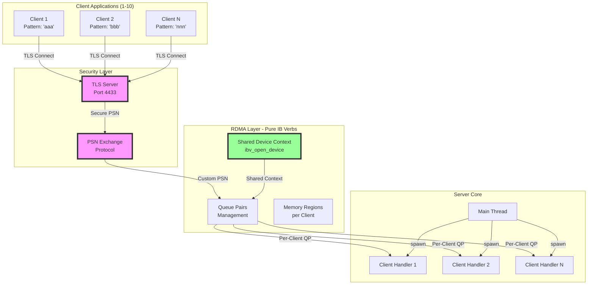
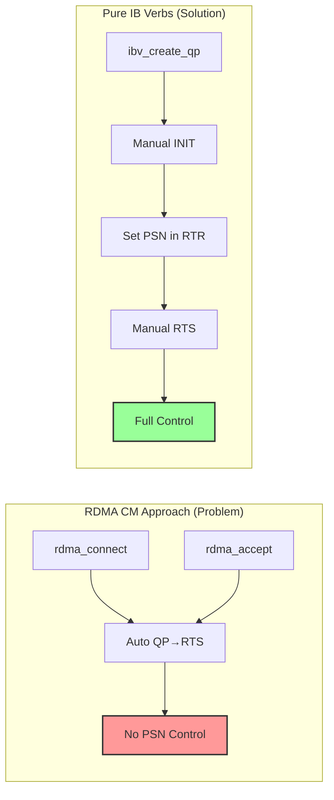
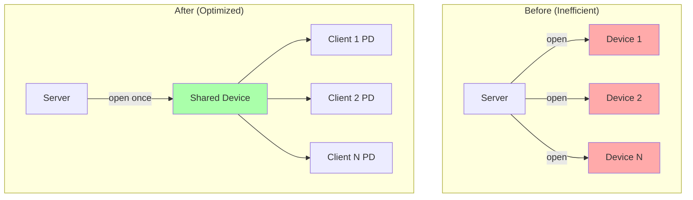
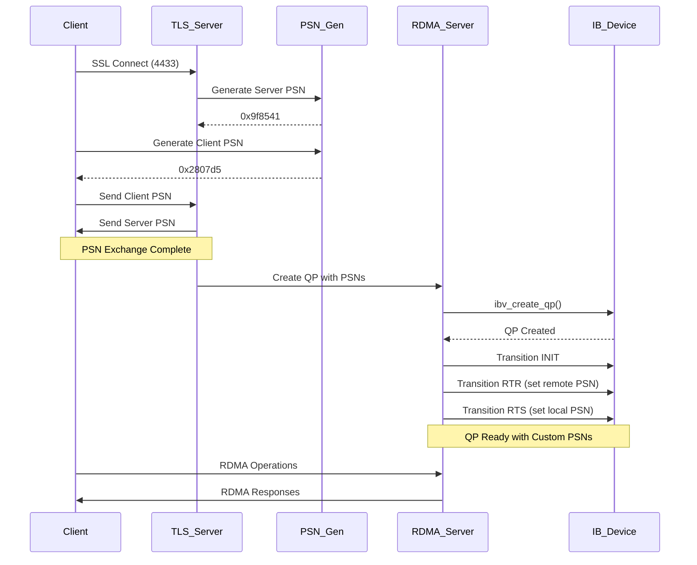
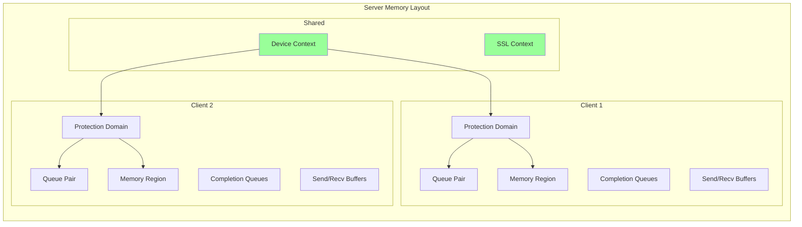
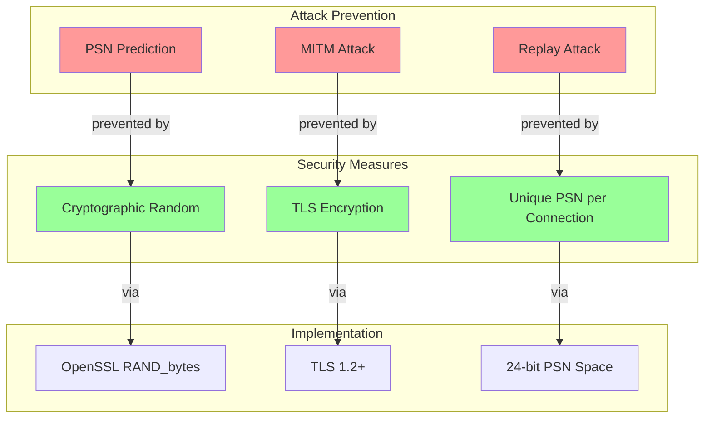
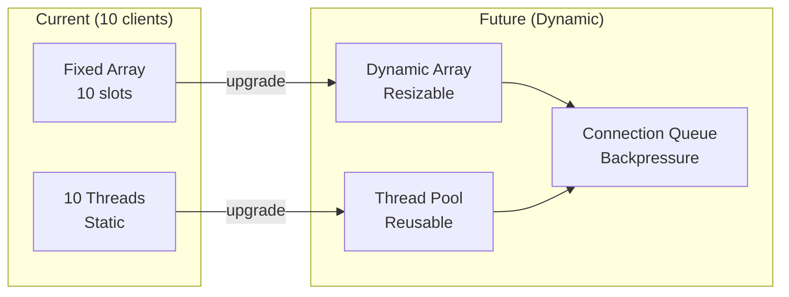

# Architecture Overview - Secure RDMA with Pure IB Verbs

## High-Level Architecture



## System Components

### 1. Security Layer
- **TLS Server**: Listens on port 4433 for secure connections
- **PSN Exchange Protocol**: Cryptographically secure PSN generation and exchange
- **Certificate Management**: Self-signed or CA certificates for TLS

### 2. RDMA Layer (Pure IB Verbs)
- **Device Management**: Single shared device context for efficiency
- **Queue Pair Control**: Manual QP creation and state transitions
- **Memory Registration**: Per-client memory regions for isolation

### 3. Server Core
- **Multi-threaded Architecture**: Dedicated thread per client
- **Resource Management**: Thread-safe client slot allocation
- **Connection Lifecycle**: Clean connection establishment and teardown

## Key Design Decisions

### Why Pure IB Verbs?



### Shared Device Context Optimization



## Connection Flow Sequence



## Thread Model

```mermaid
graph TB
    subgraph "Main Process"
        MAIN[main()]
        INIT[init_server()]
        TLS_L[TLS Listener Thread]
    end
    
    subgraph "Per-Client Threads"
        CH1[client_handler_thread 1]
        CH2[client_handler_thread 2]
        CHN[client_handler_thread N]
    end
    
    subgraph "Shared Resources"
        MUTEX[clients_mutex]
        SLOTS[client_slots[10]]
        DEV_CTX[device_context]
    end
    
    MAIN --> INIT
    INIT --> TLS_L
    
    TLS_L -->|accept| CH1
    TLS_L -->|accept| CH2
    TLS_L -->|accept| CHN
    
    CH1 -->|lock| MUTEX
    CH2 -->|lock| MUTEX
    CHN -->|lock| MUTEX
    
    MUTEX --> SLOTS
    
    CH1 -->|use| DEV_CTX
    CH2 -->|use| DEV_CTX
    CHN -->|use| DEV_CTX
    
    style MUTEX fill:#ff9
    style DEV_CTX fill:#9f9
```

## Memory Management



## Security Architecture



## Performance Characteristics

| Metric | Value | Notes |
|--------|-------|-------|
| Max Concurrent Clients | 10 | Configurable via MAX_CLIENTS |
| PSN Generation Time | < 1ms | OpenSSL RAND_bytes |
| TLS Handshake | ~50ms | One-time per client |
| QP Setup Time | ~10ms | Including state transitions |
| Message Latency | < 1ms | RDMA zero-copy |
| Resource Sharing | 90% reduction | Single device context |

## Scalability Considerations



## Next: [Low-Level Design](LOW_LEVEL_DESIGN.md)