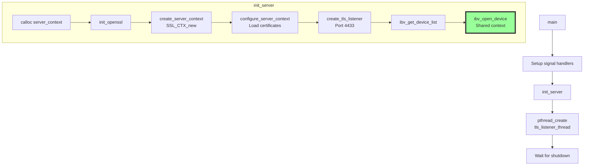
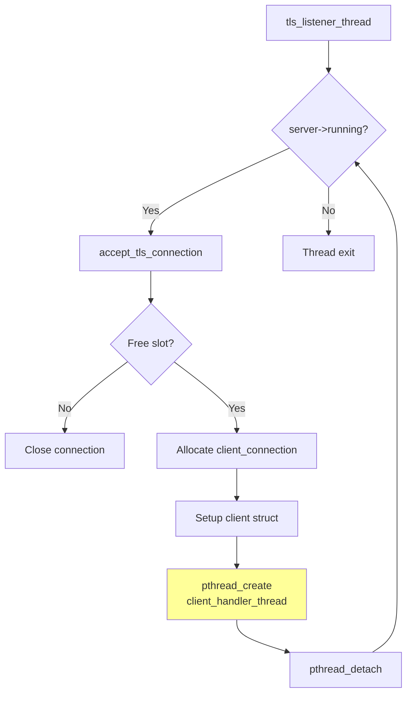
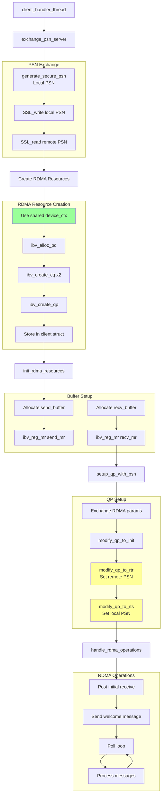
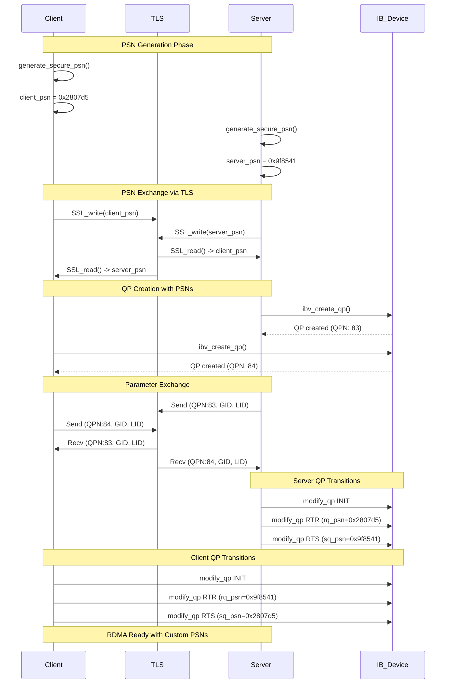
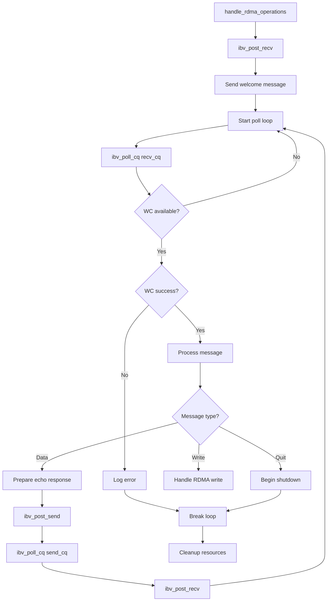
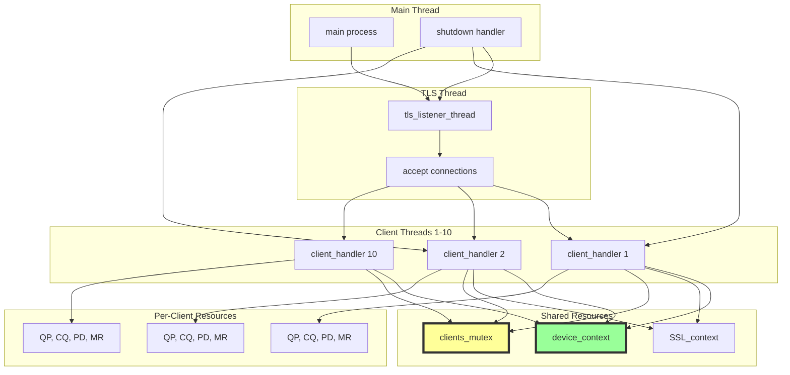
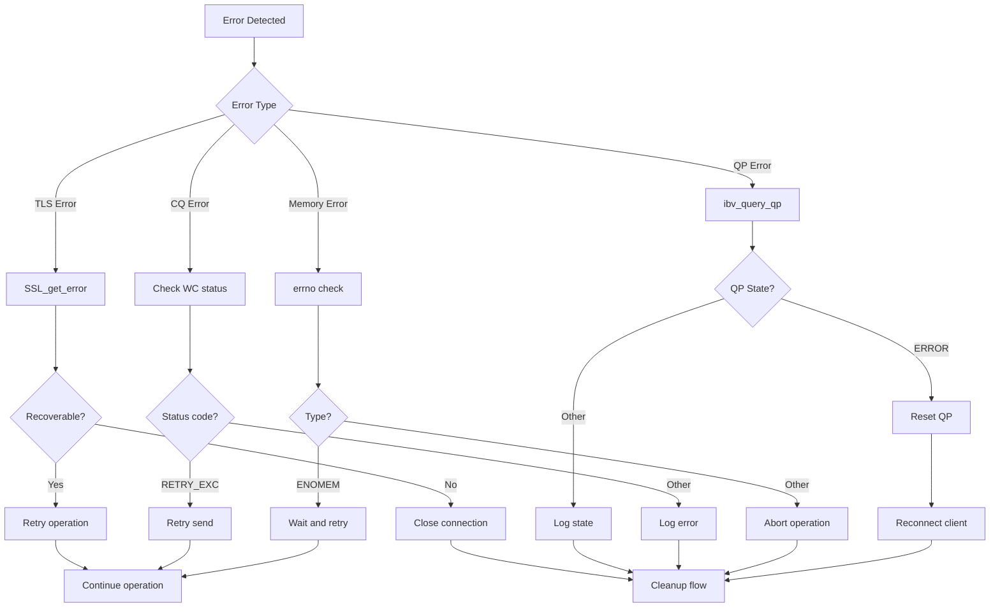
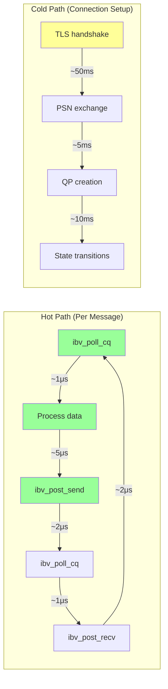

# Implementation Flow - Complete Function Interaction

## Server Startup Flow



## TLS Listener Thread Flow



## Client Handler Thread - Complete Flow



## Detailed PSN Setup Flow



## Message Processing Flow



## Resource Cleanup Flow

```mermaid
flowchart TD
    CLEANUP_START[Client disconnect/error] --> DEREG[Deregister memory]
    
    subgraph "Memory Cleanup"
        M1[ibv_dereg_mr send_mr]
        M2[ibv_dereg_mr recv_mr]
        M3[free send_buffer]
        M4[free recv_buffer]
        M1 --> M2
        M2 --> M3
        M3 --> M4
    end
    
    DEREG --> M1
    M4 --> DESTROY[Destroy RDMA objects]
    
    subgraph "RDMA Cleanup"
        D1[ibv_destroy_qp]
        D2[ibv_destroy_cq send_cq]
        D3[ibv_destroy_cq recv_cq]
        D4[ibv_dealloc_pd]
        D1 --> D2
        D2 --> D3
        D3 --> D4
    end
    
    DESTROY --> D1
    D4 --> TLS_CLOSE[close_tls_connection]
    
    subgraph "TLS Cleanup"
        T1[SSL_shutdown]
        T2[SSL_free]
        T3[close socket]
        T1 --> T2
        T2 --> T3
    end
    
    TLS_CLOSE --> T1
    T3 --> SLOT[Update server state]
    
    subgraph "Server State Update"
        S1[Lock mutex]
        S2[Clear client slot]
        S3[Decrement num_clients]
        S4[Unlock mutex]
        S1 --> S2
        S2 --> S3
        S3 --> S4
    end
    
    SLOT --> S1
    S4 --> FREE[free client struct]
    FREE --> EXIT[Thread exit]
    
    style D4 fill:#ff9
    note right of D4
        Don't close device_ctx!
        It's shared by all clients
    end note
```

## Complete System Interaction



## Error Recovery Flows



## Performance Critical Path



## Next: [Testing and Validation](TESTING_VALIDATION.md)