# Low-Level Design - Implementation Details

## Core Data Structures

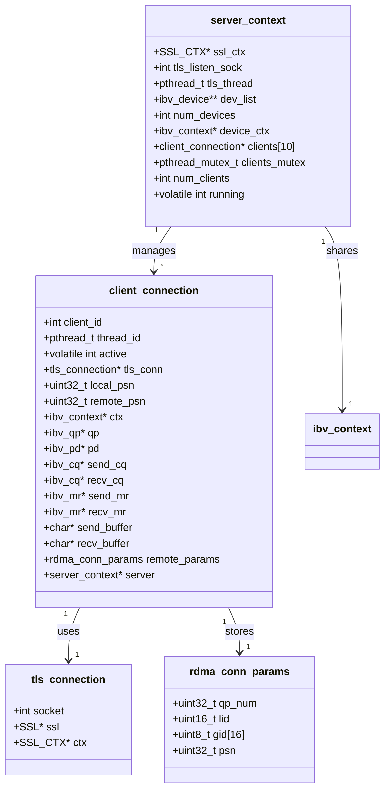

## Function Call Flow

### Server Initialization

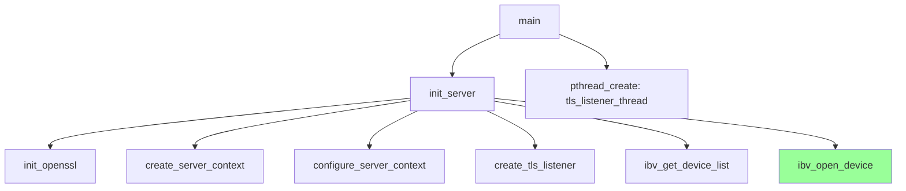

### Client Connection Flow

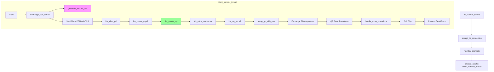

### QP State Transition Detail

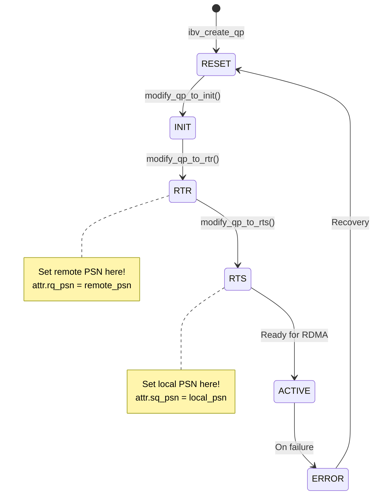

## PSN Exchange Protocol

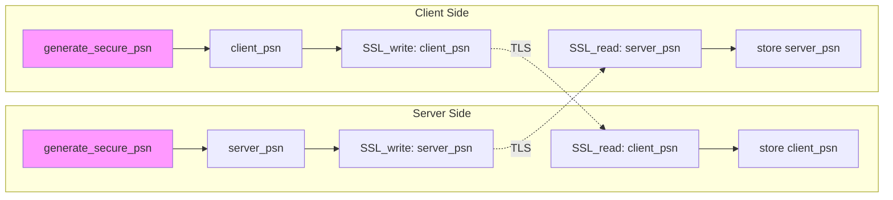

## Memory Registration and Buffer Management

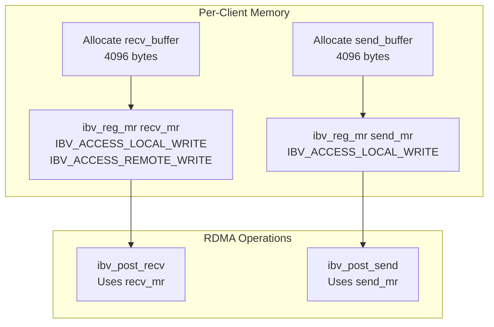

## Critical Functions Implementation

### 1. generate_secure_psn()
```c
uint32_t generate_secure_psn() {
    uint32_t psn;
    // Try OpenSSL first
    if (RAND_bytes(&psn, sizeof(psn)) == 1) {
        return psn & 0xFFFFFF;  // 24-bit PSN
    }
    // Fallback to /dev/urandom
    int fd = open("/dev/urandom", O_RDONLY);
    read(fd, &psn, sizeof(psn));
    close(fd);
    return psn & 0xFFFFFF;
}
```

### 2. setup_qp_with_psn()
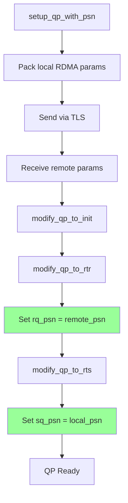

### 3. handle_rdma_operations()
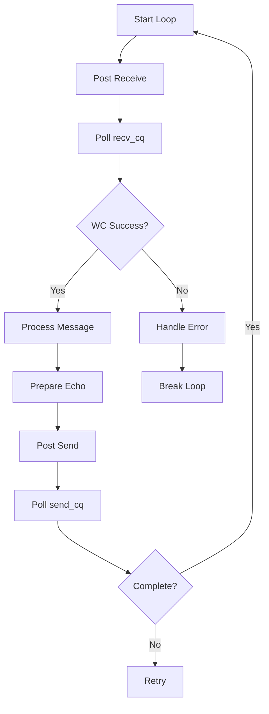

## Thread Safety Mechanisms

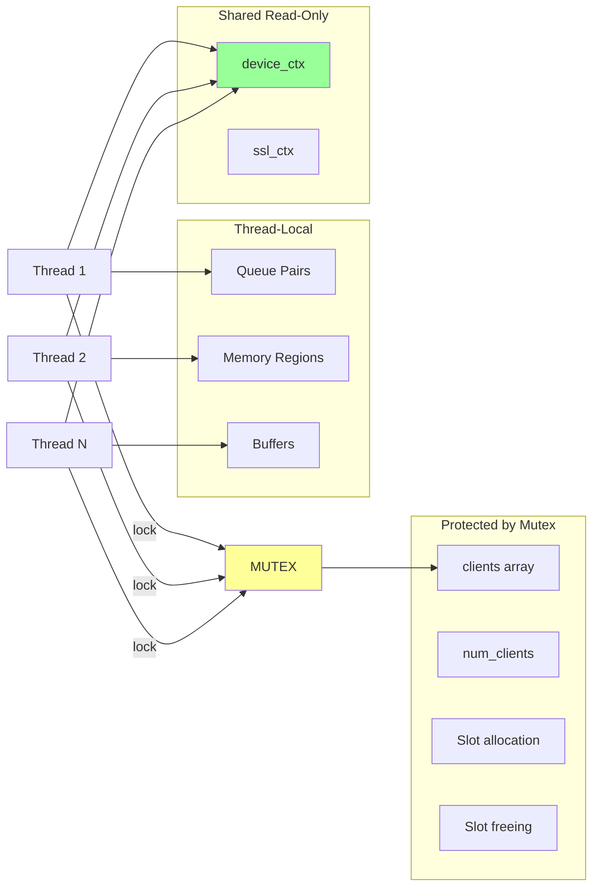

## Error Handling Flow

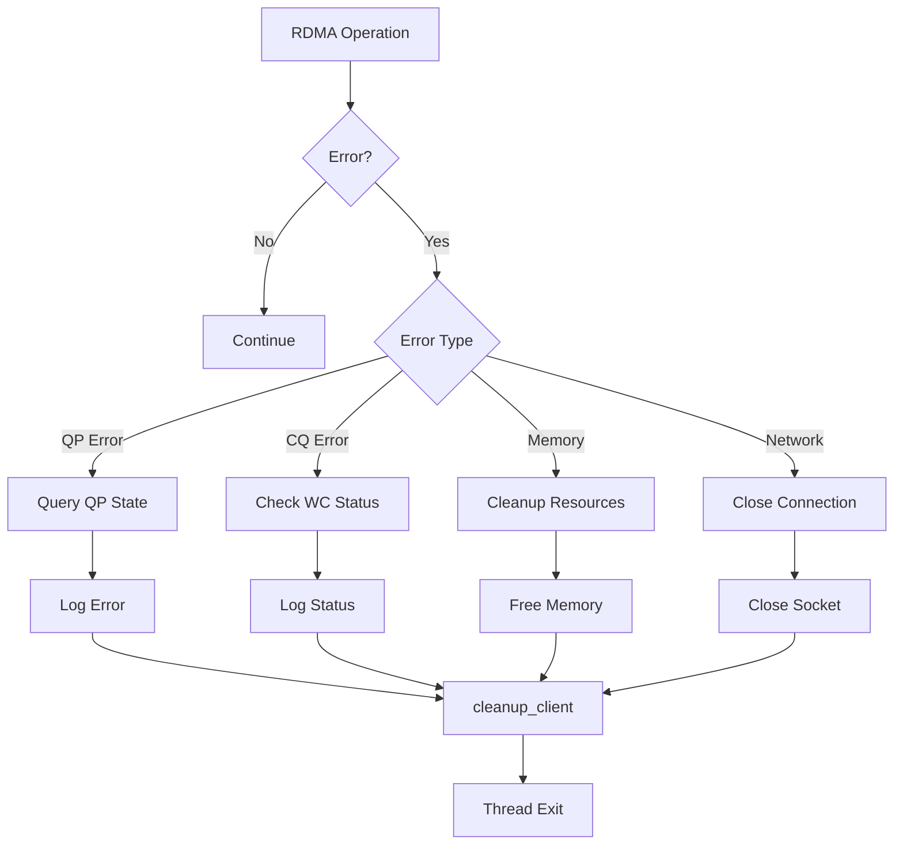

## Resource Cleanup Sequence

```mermaid
flowchart TD
    DISCONNECT[Client Disconnect] --> DEREG_MR[ibv_dereg_mr x2]
    DEREG_MR --> DESTROY_QP[ibv_destroy_qp]
    DESTROY_QP --> DESTROY_CQ[ibv_destroy_cq x2]
    DESTROY_CQ --> DEALLOC_PD[ibv_dealloc_pd]
    DEALLOC_PD --> FREE_BUF[free buffers]
    FREE_BUF --> CLOSE_TLS[close_tls_connection]
    CLOSE_TLS --> UPDATE_SLOT[Clear client slot]
    UPDATE_SLOT --> DEC_COUNT[Decrement num_clients]
    
    style DEALLOC_PD fill:#f99
    note right of DEALLOC_PD
        Don't close device_ctx!
        It's shared
    end note
```

## Performance Optimizations

```mermaid
graph TB
    subgraph "Optimization 1: Shared Device Context"
        O1[Single ibv_open_device] --> O1R[90% memory reduction]
    end
    
    subgraph "Optimization 2: Pre-allocated Buffers"
        O2[4KB fixed buffers] --> O2R[No dynamic allocation]
    end
    
    subgraph "Optimization 3: Completion Queue Polling"
        O3[Non-blocking poll] --> O3R[Low latency]
    end
    
    subgraph "Optimization 4: Thread Pool (Future)"
        O4[Reuse threads] --> O4R[Reduce creation overhead]
    end
    
    style O1 fill:#9f9
    style O2 fill:#9f9
    style O3 fill:#9f9
    style O4 fill:#ff9
```

## Configuration Parameters

| Parameter | Value | Location | Purpose |
|-----------|-------|----------|---------|
| MAX_CLIENTS | 10 | secure_rdma_server.c:21 | Maximum concurrent clients |
| BUFFER_SIZE | 4096 | secure_rdma_server.c:23 | Message buffer size |
| TLS_PORT | 4433 | tls_utils.h:14 | TLS listener port |
| RDMA_PORT | 4791 | secure_rdma_server.c:22 | RDMA port (unused with pure IB) |
| TIMEOUT_MS | 5000 | secure_rdma_server.c:24 | Operation timeout |
| PSN_MASK | 0xFFFFFF | tls_utils.c | 24-bit PSN space |

## Next: [Security Design](SECURITY_DESIGN.md)