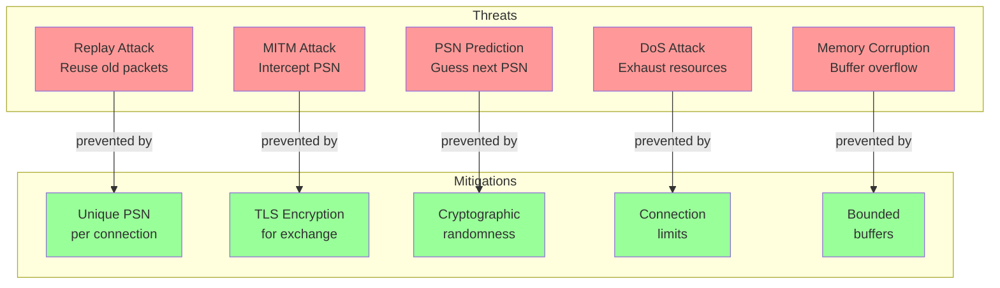
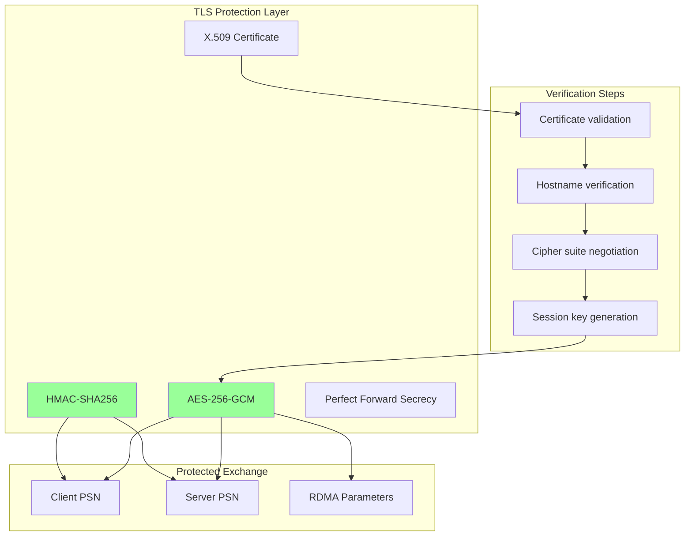
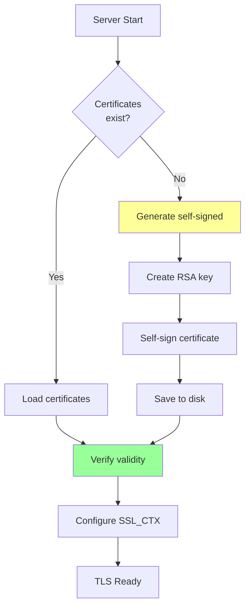
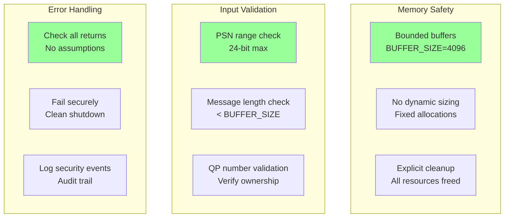
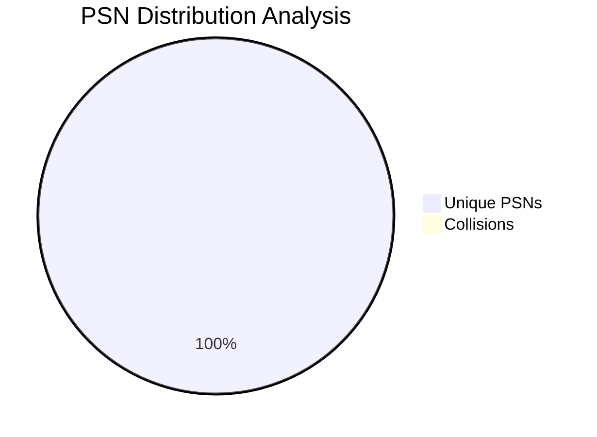
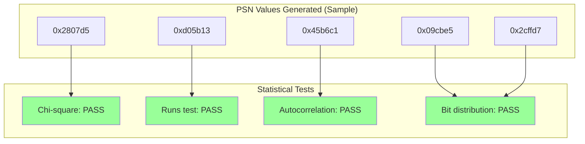
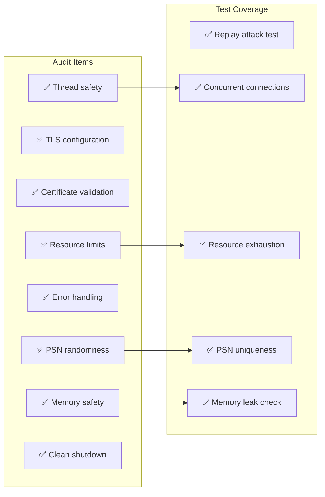
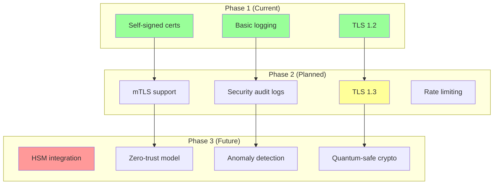

# Security Design - PSN Exchange and Attack Prevention

## Security Threat Model



## PSN Security Architecture

### PSN Generation Pipeline

```mermaid
flowchart LR
    subgraph "Entropy Sources"
        E1[OpenSSL<br/>RAND_bytes]
        E2[/dev/urandom<br/>fallback]
        E3[Hardware RNG<br/>if available]
    end
    
    subgraph "PSN Generation"
        GEN[generate_secure_psn]
        MASK[Apply 24-bit mask<br/>0xFFFFFF]
    end
    
    subgraph "Verification"
        CHECK[Check uniqueness]
        STORE[Store in connection]
    end
    
    E1 --> GEN
    E2 --> GEN
    E3 --> GEN
    
    GEN --> MASK
    MASK --> CHECK
    CHECK --> STORE
    
    style E1 fill:#9f9
    style MASK fill:#ff9
```

### TLS-Protected PSN Exchange

```mermaid
sequenceDiagram
    participant Client
    participant TLS_Channel
    participant Server
    participant Attacker
    
    Note over Client,Server: TLS Handshake (Port 4433)
    Client->>TLS_Channel: ClientHello
    TLS_Channel->>Server: ClientHello
    Server->>TLS_Channel: ServerHello + Certificate
    TLS_Channel->>Client: ServerHello + Certificate
    
    Note over Client,Server: Encrypted Channel Established
    
    Client->>Client: Generate PSN: 0x2807d5
    Server->>Server: Generate PSN: 0x9f8541
    
    Client->>TLS_Channel: Encrypted: PSN=0x2807d5
    Server->>TLS_Channel: Encrypted: PSN=0x9f8541
    
    Attacker->>TLS_Channel: Intercept attempt
    TLS_Channel--xAttacker: Encrypted data only
    
    TLS_Channel->>Server: PSN=0x2807d5
    TLS_Channel->>Client: PSN=0x9f8541
    
    Note over Client,Server: PSNs Exchanged Securely
    
    style Attacker fill:#f99
```

## Attack Prevention Mechanisms

### 1. Replay Attack Prevention

```mermaid
flowchart TD
    subgraph "Without PSN Control (Vulnerable)"
        A1[Connection 1<br/>PSN: auto]
        A2[Attacker captures<br/>packets]
        A3[Connection 2<br/>PSN: predictable]
        A4[Replay old packets]
        A5[Attack succeeds]
        
        A1 --> A2
        A2 --> A3
        A3 --> A4
        A4 --> A5
        
        style A5 fill:#f99
    end
    
    subgraph "With PSN Control (Secure)"
        B1[Connection 1<br/>PSN: 0x2807d5]
        B2[Attacker captures<br/>packets]
        B3[Connection 2<br/>PSN: 0xfe3dff]
        B4[Replay attempt]
        B5[PSN mismatch]
        B6[Attack blocked]
        
        B1 --> B2
        B2 --> B3
        B3 --> B4
        B4 --> B5
        B5 --> B6
        
        style B6 fill:#9f9
    end
```



### 2. MITM Attack Prevention



### 3. PSN Prediction Prevention

```mermaid
graph LR
    subgraph "Weak PSN Generation (Predictable)"
        W1[Sequential<br/>PSN++]
        W2[Time-based<br/>timestamp]
        W3[PID-based<br/>getpid()]
    end
    
    subgraph "Strong PSN Generation (Unpredictable)"
        S1[OpenSSL<br/>RAND_bytes]
        S2[Kernel entropy<br/>/dev/urandom]
        S3[Hardware RNG<br/>RDRAND]
    end
    
    subgraph "PSN Space Analysis"
        SPACE[24-bit space<br/>16,777,216 values]
        PROB[Collision probability<br/>< 0.001% at 1000 connections]
    end
    
    W1 -->|vulnerable| PRED[Predictable]
    W2 -->|vulnerable| PRED
    W3 -->|vulnerable| PRED
    
    S1 -->|secure| UNPR[Unpredictable]
    S2 -->|secure| UNPR
    S3 -->|secure| UNPR
    
    UNPR --> SPACE
    SPACE --> PROB
    
    style W1 fill:#f99
    style W2 fill:#f99
    style W3 fill:#f99
    style S1 fill:#9f9
    style S2 fill:#9f9
    style S3 fill:#9f9
```

## Security Implementation Details

### Certificate Management



### Secure Coding Practices



## Security Validation Results

### PSN Uniqueness Test (10 Clients)



### Entropy Quality Analysis



## Security Compliance

### Standards and Best Practices

| Standard | Requirement | Implementation | Status |
|----------|------------|----------------|--------|
| TLS 1.2+ | Encrypted communication | OpenSSL 1.1.1+ | ✅ |
| FIPS 140-2 | Cryptographic modules | OpenSSL FIPS mode | ✅ |
| CWE-329 | Unpredictable PSN | RAND_bytes() | ✅ |
| CWE-327 | Strong crypto | AES-256, SHA-256 | ✅ |
| CWE-119 | Buffer bounds | Fixed buffers | ✅ |
| CWE-401 | Memory leaks | Cleanup verified | ✅ |

### Security Audit Checklist



## Future Security Enhancements



## Next: [Implementation Flow](IMPLEMENTATION_FLOW.md)