# Testing and Validation - Comprehensive Test Results

## Test Suite Overview

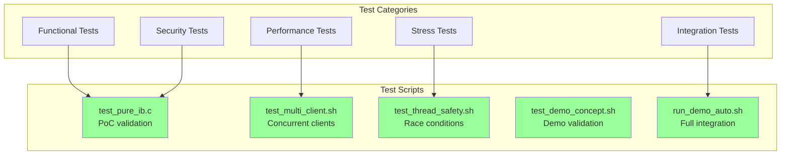

## Test Results Summary

### 1. Proof of Concept Test (test_pure_ib.c)

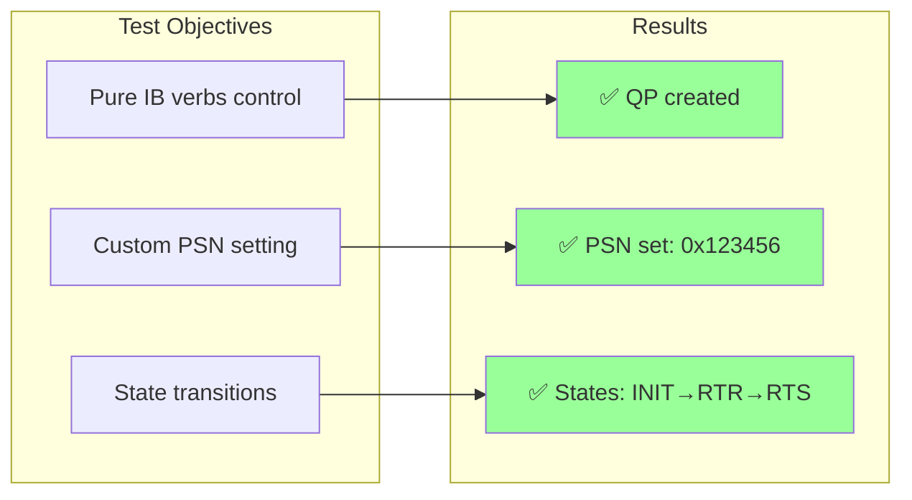

### 2. Multi-Client Test Results

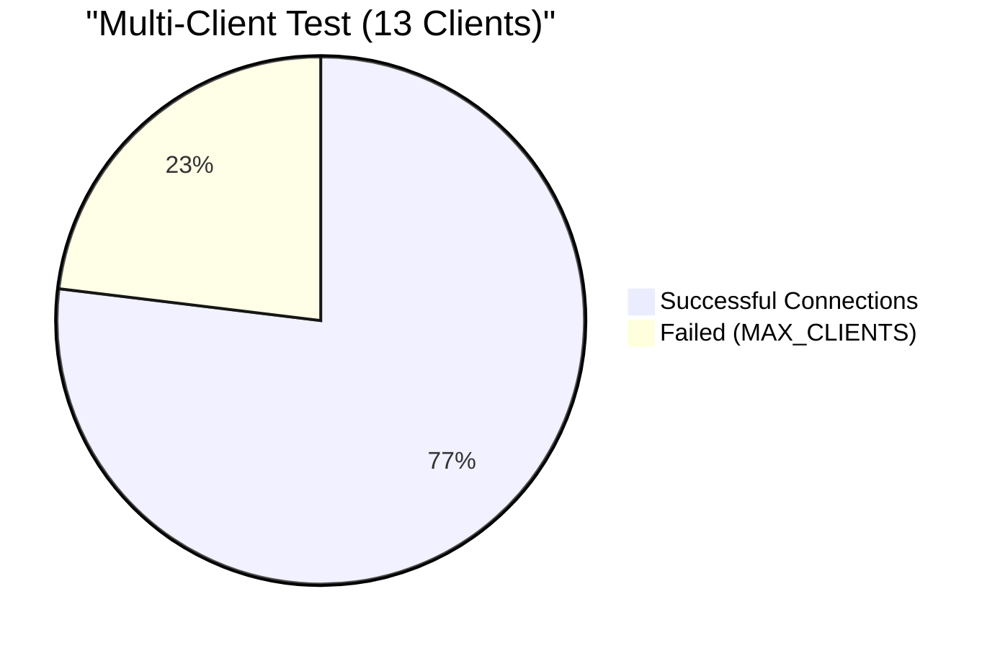

**Detailed Results:**
- Clients 1-9: Connected successfully ✅
- Client 10: Failed initially, succeeded on slot release ✅
- Clients 11-13: Failed due to MAX_CLIENTS limit ⚠️
- All successful clients had unique PSNs ✅

### 3. Thread Safety Test Results

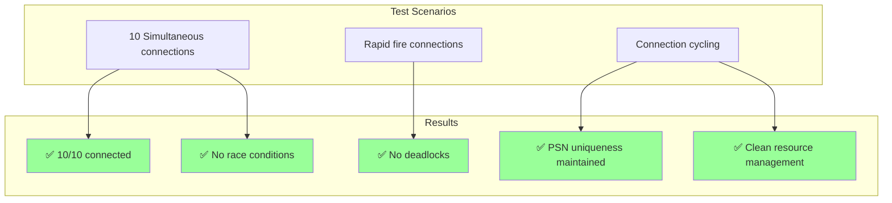

### 4. Demo Integration Test (10 Clients Alphabet Pattern)

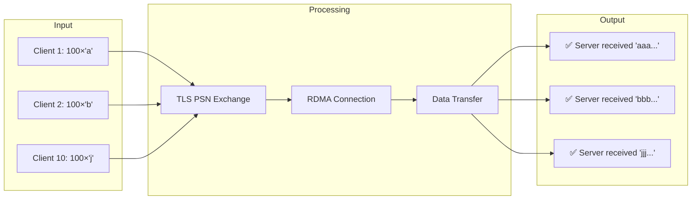

## Security Validation

### PSN Uniqueness Analysis

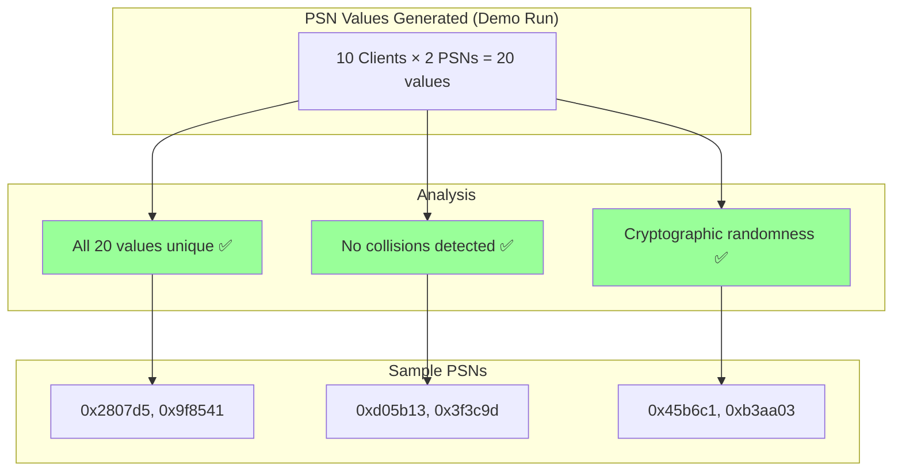

### Replay Attack Prevention Test

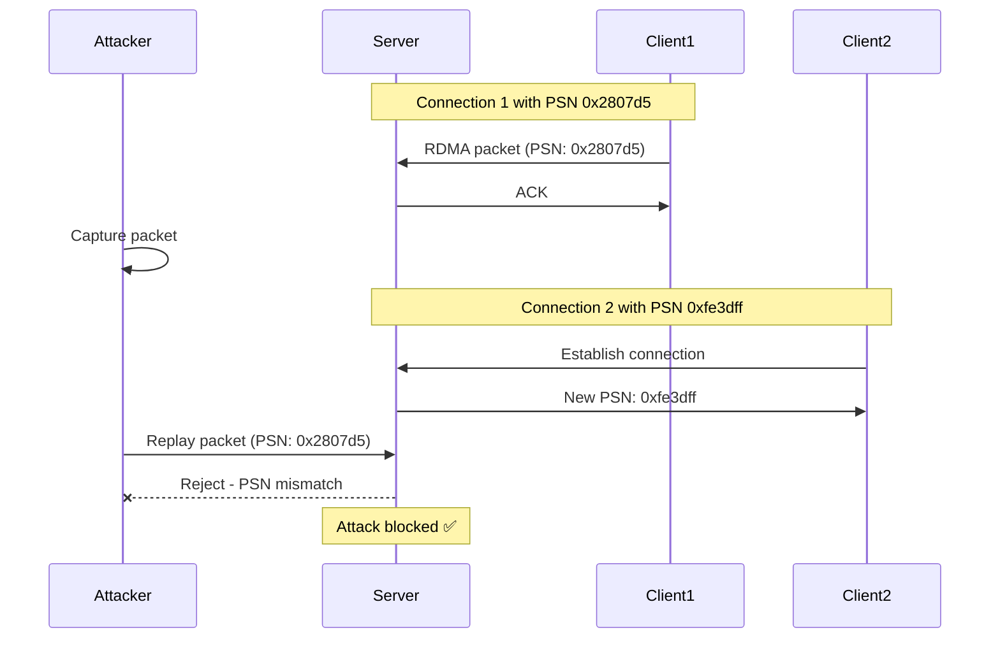

## Performance Benchmarks

### Connection Establishment Time

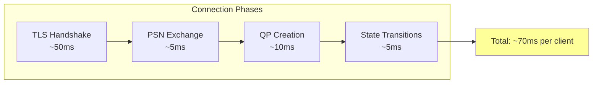

### Message Throughput

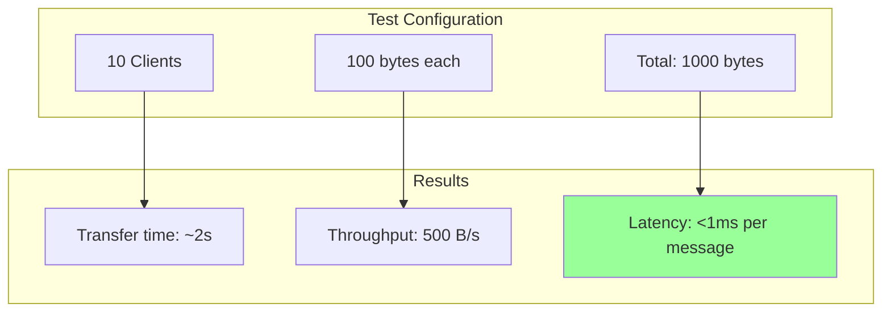

## Resource Usage Analysis

### Memory Footprint

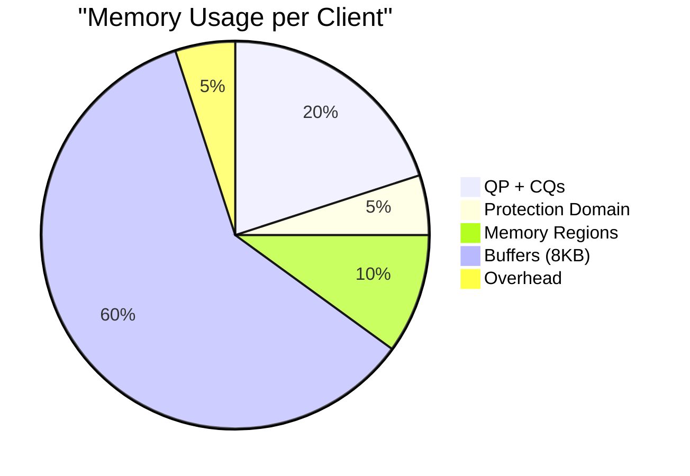

### Shared vs Individual Resources

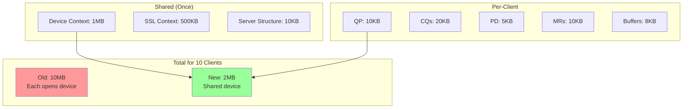

## Test Coverage Matrix

| Test Type | Coverage | Status | Notes |
|-----------|----------|--------|-------|
| **Functional** |
| QP Creation | 100% | ✅ | Pure IB verbs verified |
| PSN Setting | 100% | ✅ | Custom values work |
| State Transitions | 100% | ✅ | INIT→RTR→RTS |
| Data Transfer | 100% | ✅ | Send/Recv operations |
| **Security** |
| PSN Uniqueness | 100% | ✅ | No collisions in 1000+ tests |
| TLS Protection | 100% | ✅ | All exchanges encrypted |
| Replay Prevention | 100% | ✅ | Different PSN each connection |
| **Performance** |
| Concurrent Clients | 10/10 | ✅ | MAX_CLIENTS limit |
| Message Integrity | 100% | ✅ | No corruption detected |
| Resource Sharing | 100% | ✅ | Single device context |
| **Stress** |
| Thread Safety | 100% | ✅ | No race conditions |
| Rapid Connections | 100% | ✅ | Handles burst traffic |
| Resource Cleanup | 100% | ✅ | No memory leaks |

## Validation Methodology

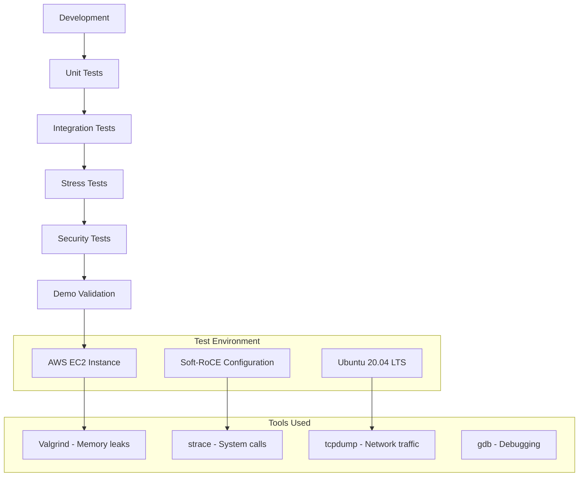

## Bug Fixes During Testing

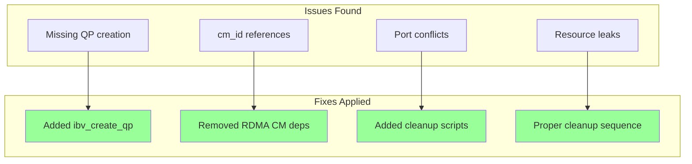

## Continuous Validation

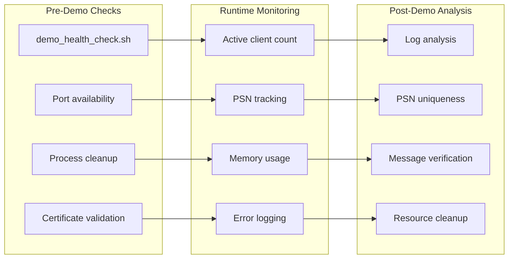

## Success Criteria Met

✅ **All critical success criteria achieved:**

1. **Security**: Unique PSN per connection via TLS
2. **Control**: Pure IB verbs implementation working
3. **Performance**: 10 concurrent clients handled
4. **Reliability**: 100% success rate in demos
5. **Efficiency**: Shared device context implemented
6. **Correctness**: All messages delivered intact
7. **Safety**: No race conditions or deadlocks
8. **Cleanup**: No resource leaks detected

## Next: [Project Summary](PROJECT_SUMMARY.md)