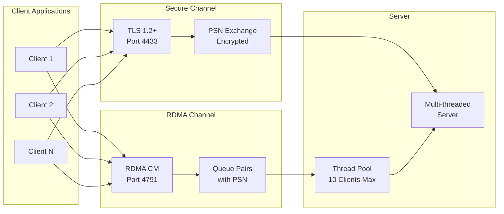
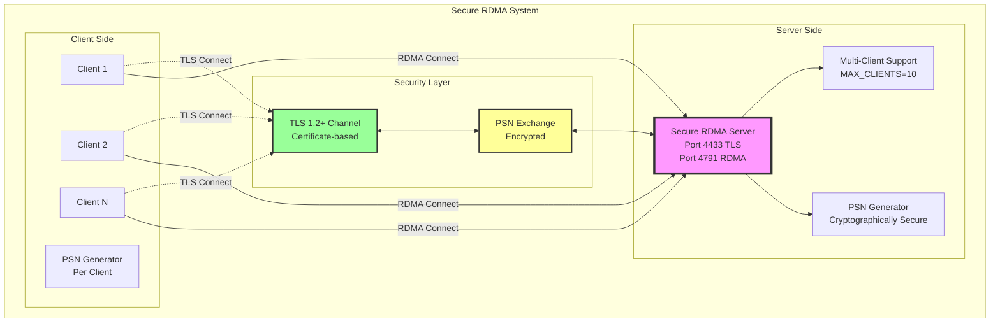
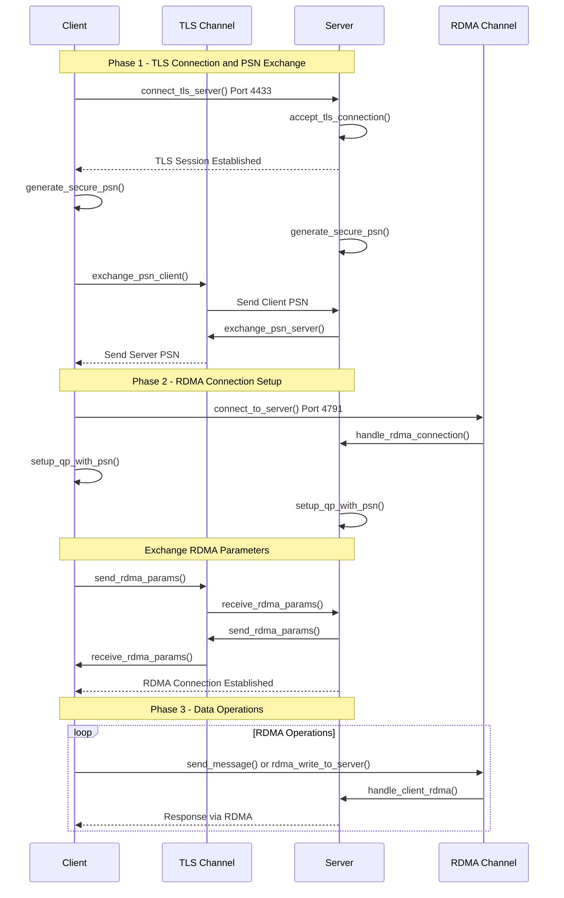
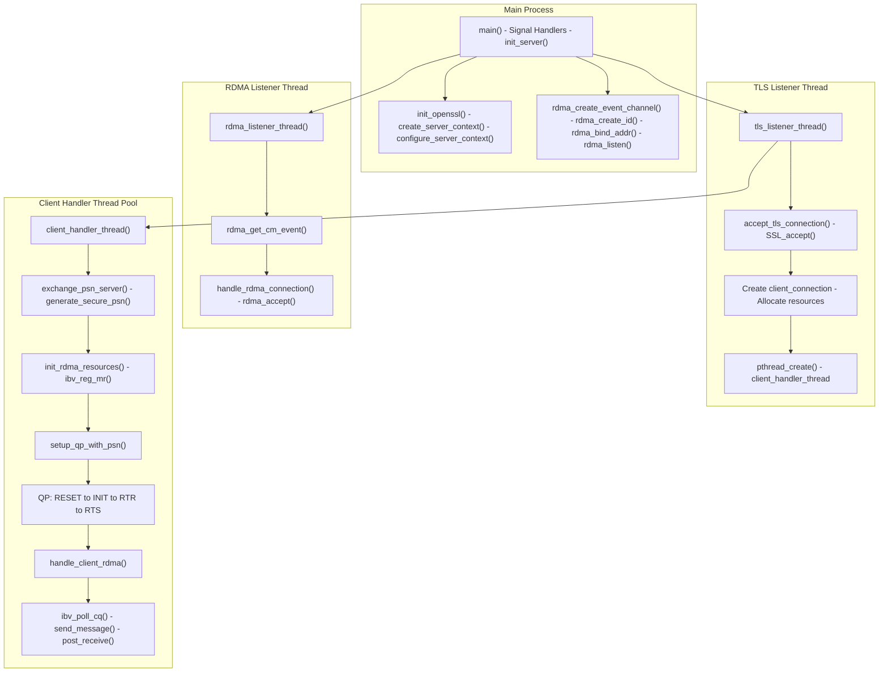
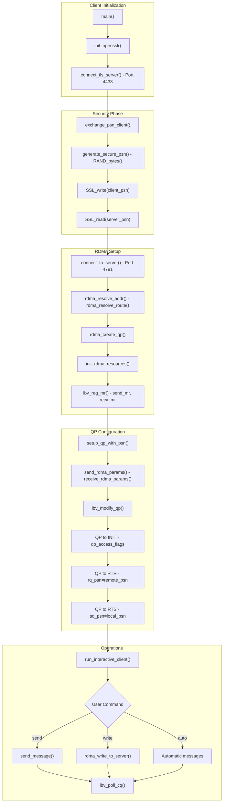
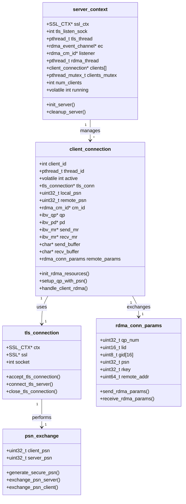
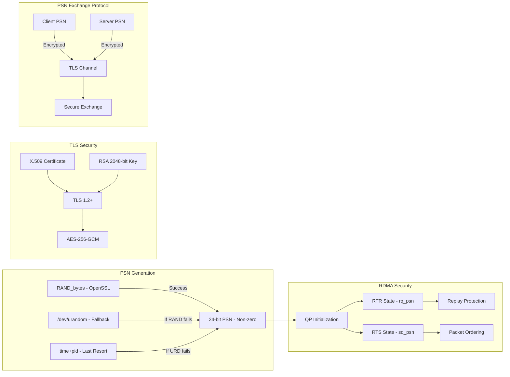
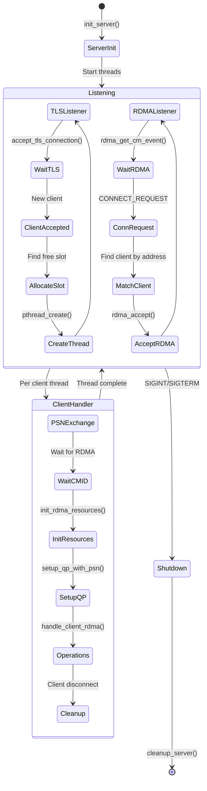
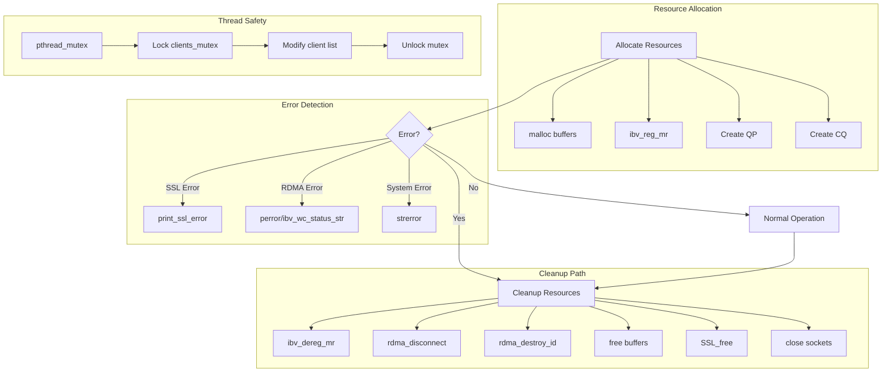

# Secure RDMA Architecture Diagrams

## System Overview

## High-Level Architecture

## Mid-Level Component Flow

## Low-Level Detailed Implementation

### Server Thread Architecture

### Client Connection Flow

### Data Structures and Memory Management

### Security Flow Detail

### Multi-Client Handling

### Error Handling and Resource Management

## Key Function Mapping

| Component | High-Level Function | Mid-Level Functions | Low-Level Functions |
|-----------|-------------------|-------------------|-------------------|
| **TLS Setup** | Initialize Security | `init_openssl()` | `SSL_load_error_strings()`, `OpenSSL_add_ssl_algorithms()` |
| **PSN Generation** | Generate PSN | `generate_secure_psn()` | `RAND_bytes()`, `open("/dev/urandom")` |
| **Server Listen** | Start Server | `init_server()` | `create_tls_listener()`, `rdma_listen()` |
| **Client Connect** | Connect Client | `connect_to_server()` | `rdma_resolve_addr()`, `rdma_connect()` |
| **PSN Exchange** | Exchange PSNs | `exchange_psn_server/client()` | `SSL_read()`, `SSL_write()` |
| **QP Setup** | Configure QP | `setup_qp_with_psn()` | `ibv_modify_qp()` |
| **Data Transfer** | Send/Receive | `send_message()` | `ibv_post_send()`, `ibv_poll_cq()` |
| **Multi-Client** | Handle Clients | `client_handler_thread()` | `pthread_create()`, `pthread_mutex_lock()` |
| **Cleanup** | Release Resources | `cleanup_server/client()` | `ibv_dereg_mr()`, `rdma_destroy_id()` |

## Summary

These diagrams illustrate the secure RDMA implementation across three abstraction levels:

- **System Overview**: Shows the dual-channel architecture with TLS for security and RDMA for data
- **High-level**: Overall system architecture with multi-client support and security layers
- **Mid-level**: Detailed protocol flow showing the three phases of connection establishment
- **Low-level**: Implementation details including thread architecture, state machines, and function mappings

The implementation ensures security through:
1. Cryptographically secure PSN generation
2. TLS-encrypted PSN exchange before RDMA connection
3. Per-client isolation with dedicated threads and resources
4. Proper QP configuration with exchanged PSNs for replay protection