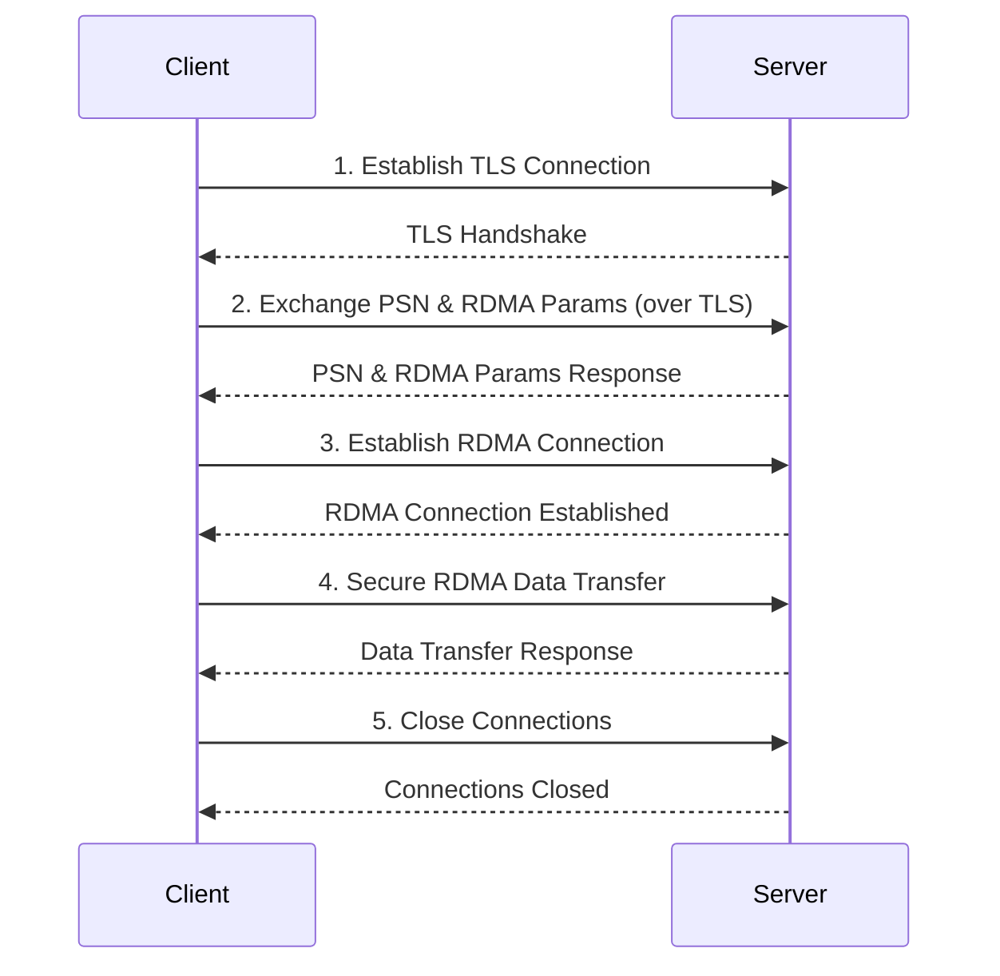

```mermaid
sequenceDiagram
    participant Client
    participant Server

    Client->>Server: 1. Establish TLS Connection
    Server-->>Client: TLS Handshake
    Client->>Server: 2. Exchange PSN & RDMA Params (over TLS)
    Server-->>Client: PSN & RDMA Params Response
    Client->>Server: 3. Establish RDMA Connection
    Server-->>Client: RDMA Connection Established
    Client->>Server: 4. Secure RDMA Data Transfer
    Server-->>Client: Data Transfer Response
    Client->>Server: 5. Close Connections
    Server-->>Client: Connections Closed
```