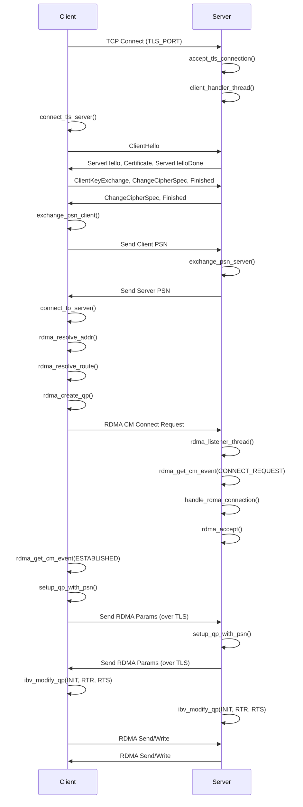

```mermaid
sequenceDiagram
    participant C as Client
    participant S as Server

    C->>S: TCP Connect (TLS_PORT)
    S->>S: accept_tls_connection()
    S->>S: client_handler_thread()

    C->>C: connect_tls_server()
    C->>S: ClientHello
    S->>C: ServerHello, Certificate, ServerHelloDone
    C->>S: ClientKeyExchange, ChangeCipherSpec, Finished
    S->>C: ChangeCipherSpec, Finished

    C->>C: exchange_psn_client()
    C->>S: Send Client PSN
    S->>S: exchange_psn_server()
    S->>C: Send Server PSN

    C->>C: connect_to_server()
    C->>C: rdma_resolve_addr()
    C->>C: rdma_resolve_route()
    C->>C: rdma_create_qp()
    C->>S: RDMA CM Connect Request

    S->>S: rdma_listener_thread()
    S->>S: rdma_get_cm_event(CONNECT_REQUEST)
    S->>S: handle_rdma_connection()
    S->>S: rdma_accept()

    C->>C: rdma_get_cm_event(ESTABLISHED)
    C->>C: setup_qp_with_psn()
    C->>S: Send RDMA Params (over TLS)

    S->>S: setup_qp_with_psn()
    S->>C: Send RDMA Params (over TLS)

    C->>C: ibv_modify_qp(INIT, RTR, RTS)
    S->>S: ibv_modify_qp(INIT, RTR, RTS)

    C->>S: RDMA Send/Write
    S->>C: RDMA Send/Write
```