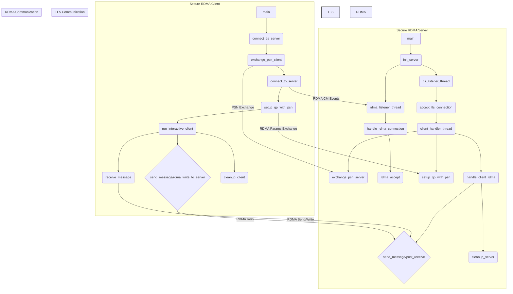

```mermaid
graph TD
    subgraph Secure RDMA Client
        A[main] --> B(connect_tls_server);
        B --> C(exchange_psn_client);
        C --> D(connect_to_server);
        D --> E(setup_qp_with_psn);
        E --> F(run_interactive_client);
        F --> G{send_message/rdma_write_to_server};
        F --> H(receive_message);
        F --> I(cleanup_client);
    end

    subgraph Secure RDMA Server
        J[main] --> K(init_server);
        K --> L(tls_listener_thread);
        K --> M(rdma_listener_thread);
        L --> N(accept_tls_connection);
        N --> O(client_handler_thread);
        O --> P(exchange_psn_server);
        M --> Q(handle_rdma_connection);
        Q --> R(rdma_accept);
        O --> S(setup_qp_with_psn);
        O --> T(handle_client_rdma);
        T --> U{send_message/post_receive};
        T --> V(cleanup_server);
    end

    subgraph TLS Communication
        style TLS Communication fill:#cce5ff,stroke:#333,stroke-width:2px
        C -- PSN Exchange --> P;
        E -- RDMA Params Exchange --> S;
    end

    subgraph RDMA Communication
        style RDMA Communication fill:#ccffcc,stroke:#333,stroke-width:2px
        D -- RDMA CM Events --> M;
        G -- RDMA Send/Write --> U;
        H -- RDMA Recv --> U;
    end
```