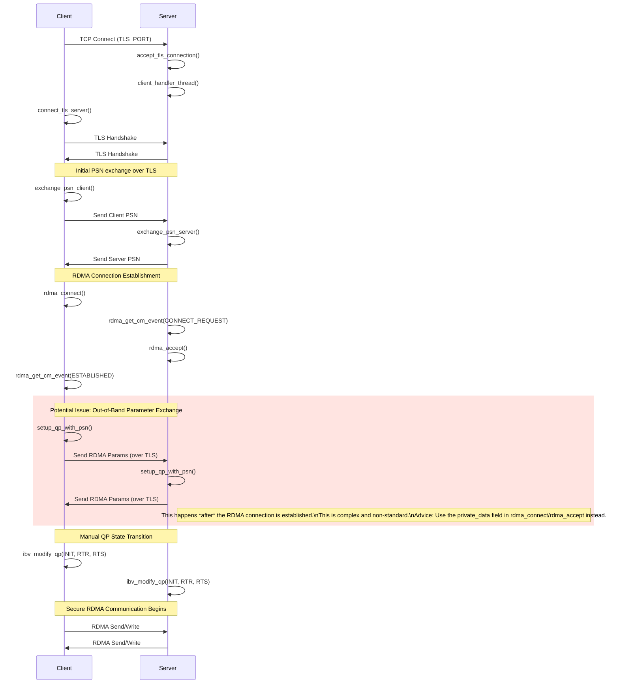

```mermaid
sequenceDiagram
    participant C as Client
    participant S as Server

    C->>S: TCP Connect (TLS_PORT)
    S->>S: accept_tls_connection()
    S->>S: client_handler_thread()

    C->>C: connect_tls_server()
    C->>S: TLS Handshake
    S->>C: TLS Handshake

    note over C,S: Initial PSN exchange over TLS
    C->>C: exchange_psn_client()
    C->>S: Send Client PSN
    S->>S: exchange_psn_server()
    S->>C: Send Server PSN

    note over C,S: RDMA Connection Establishment
    C->>C: rdma_connect()
    S->>S: rdma_get_cm_event(CONNECT_REQUEST)
    S->>S: rdma_accept()
    C->>C: rdma_get_cm_event(ESTABLISHED)

    rect rgb(255, 228, 225)
    note over C,S: Potential Issue: Out-of-Band Parameter Exchange
    C->>C: setup_qp_with_psn()
    C->>S: Send RDMA Params (over TLS)
    S->>S: setup_qp_with_psn()
    S->>C: Send RDMA Params (over TLS)
    note right of S: This happens *after* the RDMA connection is established.\nThis is complex and non-standard.\nAdvice: Use the private_data field in rdma_connect/rdma_accept instead.
    end

    note over C,S: Manual QP State Transition
    C->>C: ibv_modify_qp(INIT, RTR, RTS)
    S->>S: ibv_modify_qp(INIT, RTR, RTS)

    note over C,S: Secure RDMA Communication Begins
    C->>S: RDMA Send/Write
    S->>C: RDMA Send/Write
```