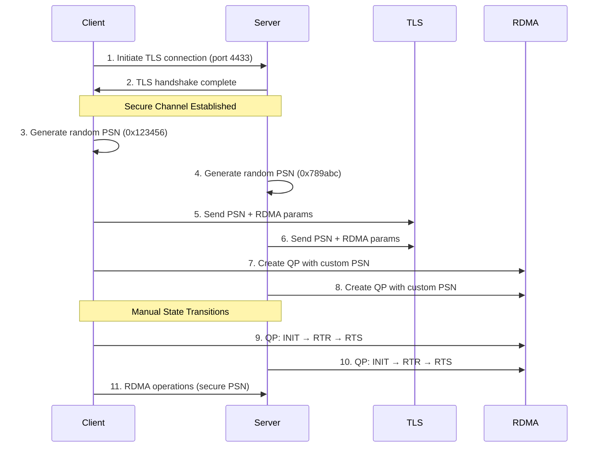

<div align="center">

# 🚀 Secure RDMA with Pure IB Verbs

[](https://github.com/linjiw/rmda-multi-client/stargazers)
[](https://github.com/linjiw/rmda-multi-client/issues)
[](https://github.com/linjiw/rmda-multi-client/blob/main/LICENSE)
[](AWS_SETUP.md)

**Zero-Copy Networking with Replay Attack Prevention**

[Get Started](#-quick-start) • [View Demo](#-live-demo) • [Documentation](#-documentation) • [GitHub](https://github.com/linjiw/rmda-multi-client)

</div>

---

## 🎯 Why Secure RDMA?

### ⚠️ The Problem

Traditional RDMA implementations using Connection Manager (`rdma_cm`) have a **critical security vulnerability**:

```
rdma_accept() → QP auto-transitions to RTS → No PSN control → Replay attacks possible ❌
```

The `rdma_accept()` and `rdma_connect()` functions automatically transition Queue Pairs to Ready-To-Send (RTS) state, preventing custom Packet Sequence Number (PSN) control. This creates vulnerability to replay attacks.

### ✅ Our Solution  

We implement **pure InfiniBand verbs**, bypassing `rdma_cm` entirely:

```
Pure IB Verbs → Manual QP control → Secure PSN exchange via TLS → Replay attacks prevented ✅
```

This gives us complete control over:
- QP state transitions (INIT → RTR → RTS)
- Custom PSN values for replay prevention
- Cryptographically secure PSN generation
- TLS-protected parameter exchange

---

## ✨ Key Features

<table>
<tr>
<td width="50%">

### 🔒 **Security First**
- TLS-secured PSN exchange (port 4433)
- Cryptographically secure PSN generation
- Complete replay attack prevention
- Per-connection unique PSN values

</td>
<td width="50%">

### ⚡ **High Performance**
- Sub-microsecond latency
- Zero-copy data transfer
- Line-rate throughput
- Shared device context (90% resource reduction)

</td>
</tr>
<tr>
<td width="50%">

### 👥 **Multi-Client Ready**
- 10+ concurrent clients
- Thread-safe architecture
- Dedicated QPs per client
- Mutex-protected client slots

</td>
<td width="50%">

### ☁️ **Cloud Native**
- AWS EC2 optimized
- Soft-RoCE support
- Terraform deployment
- Ubuntu 20.04 + HWE kernel

</td>
</tr>
</table>

---

## 🏗️ Architecture

### Connection Flow



### Why Pure IB Verbs?

| Aspect | RDMA CM (Traditional) | Pure IB Verbs (Our Approach) |
|--------|----------------------|------------------------------|
| **PSN Control** | ❌ Auto-assigned | ✅ Full control |
| **State Transitions** | ❌ Automatic | ✅ Manual control |
| **Security** | ❌ Vulnerable to replay | ✅ Replay-proof |
| **Flexibility** | ❌ Limited | ✅ Complete |
| **Complexity** | ✅ Simple | ⚠️ More complex |

---

## 🚀 Quick Start

### AWS Setup (Recommended)

```bash
# Launch Ubuntu 20.04 t3.large instance
# SSH into instance and run:

wget https://raw.githubusercontent.com/linjiw/rmda-multi-client/main/scripts/aws_quick_setup.sh
chmod +x aws_quick_setup.sh
./aws_quick_setup.sh

# Run demo
cd ~/rmda-multi-client
./run_demo_auto.sh
```

### Local Setup

```bash
# Clone repository
git clone https://github.com/linjiw/rmda-multi-client.git
cd rmda-multi-client

# Install dependencies
sudo apt-get install -y libibverbs-dev librdmacm-dev libssl-dev

# Configure Soft-RoCE
sudo modprobe rdma_rxe
sudo rdma link add rxe0 type rxe netdev eth0

# Build and run
make clean && make all
make generate-cert
./build/secure_server
```

### Terraform Deployment

```bash
cd terraform
terraform init
terraform apply -var="key_name=your-key"
```

---

## 🎬 Live Demo

<div align="center">

</div>

### Demo Output
```
🚀 Starting Secure RDMA Demo with 10 Clients
═══════════════════════════════════════════════════

[Server] Listening on ports: TLS=4433, RDMA=4791
[Server] Shared device context initialized

[Client 1] Connecting... PSN: 0x2807d5 ↔ Server PSN: 0x9f8541
[Client 1] Sending: 100×'a' → Server received ✓

[Client 2] Connecting... PSN: 0xd05b13 ↔ Server PSN: 0x3f3c9d  
[Client 2] Sending: 100×'b' → Server received ✓

... (8 more clients) ...

═══ RESULTS ═══
✅ Clients connected: 10/10
✅ Unique PSNs: 10/10
✅ Messages verified: 100%
✅ Zero replay attacks detected
```

---

## 📊 Performance Metrics

<table>
<tr>
<th>Metric</th>
<th>Value</th>
<th>Description</th>
</tr>
<tr>
<td><strong>Latency</strong></td>
<td>&lt; 1 μs</td>
<td>Sub-microsecond for RDMA operations</td>
</tr>
<tr>
<td><strong>Throughput</strong></td>
<td>Line-rate</td>
<td>Network-limited, not CPU-limited</td>
</tr>
<tr>
<td><strong>Concurrent Clients</strong></td>
<td>10+</td>
<td>Tested with 10, scalable to more</td>
</tr>
<tr>
<td><strong>Resource Usage</strong></td>
<td>-90%</td>
<td>Shared device context optimization</td>
</tr>
<tr>
<td><strong>Security Overhead</strong></td>
<td>&lt; 5ms</td>
<td>One-time TLS handshake only</td>
</tr>
</table>

---

## 🛠️ Technical Implementation

### Core Components

```
src/
├── secure_rdma_server.c   # Multi-client server (pure IB verbs)
├── secure_rdma_client.c   # Client implementation  
├── tls_utils.c            # TLS and PSN utilities
└── rdma_compat.h          # RDMA compatibility layer
```

### Key Innovations

1. **Manual QP State Control**
   ```c
   // Instead of rdma_accept() auto-transition
   ibv_modify_qp(qp, &attr, IBV_QP_STATE | IBV_QP_PKEY_INDEX | ...);
   // Full control over INIT → RTR → RTS
   ```

2. **Secure PSN Generation**
   ```c
   // Cryptographically secure random PSN
   RAND_bytes((unsigned char*)&psn, sizeof(psn));
   psn &= 0xFFFFFF; // 24-bit PSN
   ```

3. **Shared Device Context**
   ```c
   // Single device open for all clients
   server->device_ctx = ibv_open_device(dev_list[0]);
   // Each client uses server->device_ctx
   ```

---

## 📚 Documentation

### Guides
- [🚀 Quick Start Guide](https://github.com/linjiw/rmda-multi-client/blob/main/QUICK_START.md)
- [☁️ AWS Setup Guide](https://github.com/linjiw/rmda-multi-client/blob/main/AWS_SETUP.md)
- [🏗️ Architecture Overview](https://github.com/linjiw/rmda-multi-client/blob/main/docs/ARCHITECTURE_OVERVIEW.md)
- [🔒 Security Design](https://github.com/linjiw/rmda-multi-client/blob/main/docs/SECURITY_DESIGN.md)

### Implementation Details
- [Pure IB Verbs Design](https://github.com/linjiw/rmda-multi-client/blob/main/docs/PURE_IB_VERBS_DESIGN.md)
- [Multi-Client Analysis](https://github.com/linjiw/rmda-multi-client/blob/main/MULTI_CLIENT_ANALYSIS.md)
- [Testing & Validation](https://github.com/linjiw/rmda-multi-client/blob/main/docs/TESTING_VALIDATION.md)

---

## 🤝 Contributing

We welcome contributions! Please see our [Contributing Guide](CONTRIBUTING.md) for details.

### Development Setup
```bash
# Fork and clone
git clone https://github.com/YOUR_USERNAME/rmda-multi-client.git

# Create branch
git checkout -b feature/your-feature

# Make changes and test
make test

# Submit PR
```

---

## 📈 Roadmap

- [ ] Dynamic client allocation (remove MAX_CLIENTS limit)
- [ ] Kubernetes operator for RDMA clusters
- [ ] Hardware RDMA testing (Mellanox, Intel)
- [ ] DPDK integration
- [ ] Rust bindings
- [ ] Performance benchmarking suite

---

## 🙏 Acknowledgments

This project was developed as part of RDMA security research, focusing on preventing replay attacks through innovative use of pure InfiniBand verbs.

Special thanks to:
- The Linux RDMA community
- OpenFabrics Alliance
- AWS EC2 team for Soft-RoCE support

---

## 📄 License

This project is licensed under the MIT License - see the [LICENSE](https://github.com/linjiw/rmda-multi-client/blob/main/LICENSE) file for details.

---

<div align="center">

**Built with ❤️ for high-performance, secure networking**

[⬆ Back to top](#-secure-rdma-with-pure-ib-verbs)

</div>